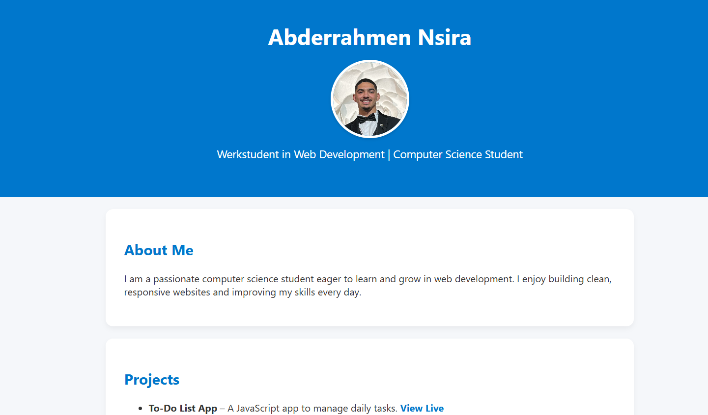

# Personal Portfolio Website

This is my personal portfolio website, built using **HTML**, **CSS**, and **JavaScript**, to showcase my skills and projects.

## 🔗 Live Demo

👉 [Visit Portfolio](https://abderrahmen-portfolio.netlify.app)

## 📸 Preview

## 📂 Features

- Clean and responsive design
- About Me section
- Project links (including To-Do List App)
- Contact information
- Deployed with Netlify

## 🛠 Tech Stack

- HTML5  
- CSS3  
- JavaScript  
- Git & GitHub  
- Netlify for hosting

## 📷 Profile

## 📬 Contact

📧 abderahmennsira@gmail.com  
💼 [GitHub](https://github.com/abdou-nsira)

